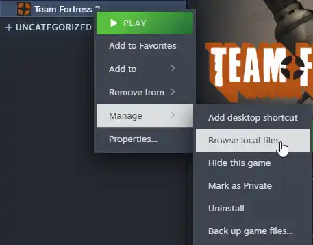

<h3 align="center">Fortress Localization Vietnamese</h3>

  Vietnamese Localization for Team Fortress 2

> [!WARNING]
> Project completion progress (updated on June 21, 2026): 64%

# INSTALLATION
1. Download the latest release here: [Releases](https://github.com/K-M19/Fortress-Localization-Vietnamese/releases)
2. Select the file named `Fortress-Localization-Vietnamese.vpk`.
3. Open Steam, right-click **Team Fortress 2**, and select **Manage → Browse Local Files** as shown below.

  

4. Navigate to the `tf\custom` folder.
5. Copy `Fortress-Localization-Vietnamese.vpk` into this folder.
6. Launch Team Fortress 2 and enjoy the Vietnamese experience.

# CREDITS
* Leader: KingDuck404
* Translators: minaly23, DFK2
* Developed: K-M19

# Available On
* [Gamebanana](https://gamebanana.com/mods/687795)

# PROGRESS

### [Screenshots](https://github.com/K-M19/Fortress-Localization-Vietnamese/blob/main/Screenshots.md)

| Category                  | Status |
| ------------------------- | ------ |
| Menus                     | ✔️     |
| Mann vs. Machine Upgrades | ✔️     |
| Core Content              | ✔️     |
| Weapon Descriptions       | ✔️     |
| Class Tips                | ✔️     |
| Secondary Content         | ❌     |
| Item Content              | ❌     |
| Missions and Contracts    | ❌     |
| Background UI Elements    | ❌     |
| Custom HUD Support        | ❌     |

# FAQ
### Q: What is this?
**A:** This is a Vietnamese localization project for Team Fortress 2.

### Q: Can I contribute to the project?
**A:** Yes. Contributions of any kind are welcome.

### Q: How do I revert TF2 back to English?
**A:** Simply remove the translation file from the `tf\custom` folder.

### Q: Why are some parts of the game still untranslated?
**A:** Certain proper nouns, such as class names, map names, and weapon names, are intentionally kept in English. Any untranslated content will be added in future updates.

### Q: The font appears broken, misaligned, or displayed incorrectly.
**A:** Due to differences between the game's original fonts and the fonts used by this localization, some elements may not display correctly. If you encounter any issues, please report them here: [Issues](https://github.com/K-M19/Fortress-Localization-Vietnamese/issues)

### Q: Some buttons cannot be clicked or do not work on my HUD.
**A:** The localization has only been tested with the game's default HUD and may not be compatible with certain custom HUDs.

### Q: Can I change the font to my preferred one?
**A:** Yes. You can customize the font by editing the configuration files and placing your desired `.ttf` font files in the `resource` folder.
